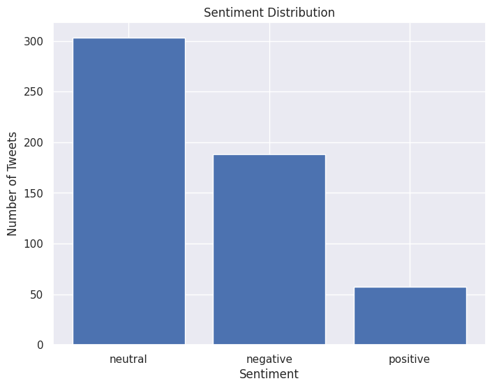
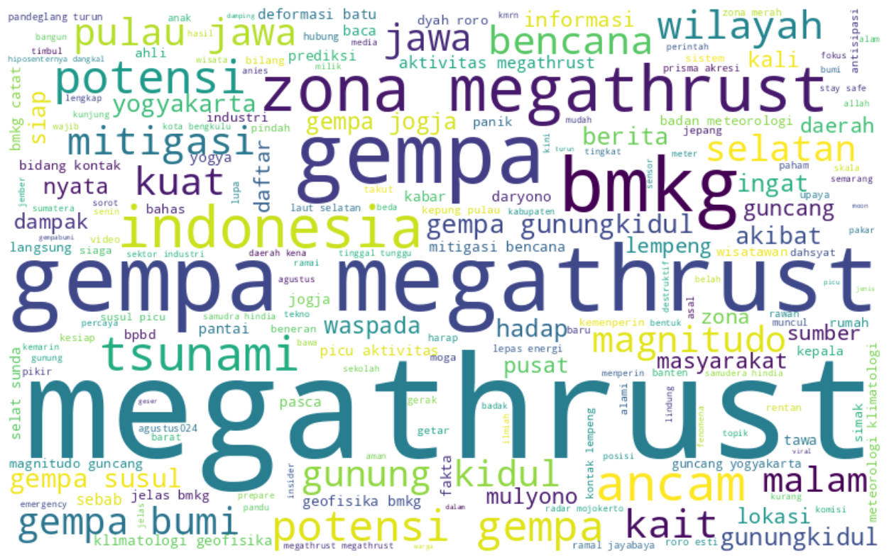

# Sentiment Analysis 'Megatrusht' in Twitter

Belakangan ini pada tahun 2024, isu mengenai gempa megatrusht menjadi perbincangan dimasyarakat. Hal ini menimbulkan kekhawatiran terhadap dampak gempa tersebut yang akan menimbulkan korban jiwa yang besar akibat bangunan-bangunan rusak, longsor, hingga tsunami. Langkah pencegahan yang dapat dilakukan untuk meminimalisir korban akibat bencana ini yaitu dengan memberikan sosialisasi mengenai mitigasi bencana agar masyarakat mengetahui hal-hal apa saja yang perlu dan tidak boleh dilakukan ketika gempa terjadi. Diharapkan dengan langkah tersebut dapat mengurangi kekhawatiran yang ada dimasyarakat dan masyarakat sudah siap kapanpun bencana tersebut terjadi. Namun untuk mengetahui bagaimana kesiapan dan respon masyarakat sejauh ini dalam menyikapi isu gempa megathrust, pada project ini dilakukan analisis sentimen dengan data yang berasal dari Twitter dengan kata kunci yaitu 'megatrusht'.

Project ini dalam melakukan analisis sentimen melakukan beberapa tahapan yang dijelaskan sebagai berikut

1. Crawling, tweet-harvest versi 2.6.1, 'megathrust lang:id until:2024-08-29 since:2024-01-01' 548 data dengan 15 kolom.
2. Text-Preprocessing
   df['full_text'][i] = re.sub(r'https\S+', '', df['full_text'][i])
   df['full_text'][i] = re.sub(r'@\S+', '', df['full_text'][i])
   df['full_text'][i] = re.sub(r'#\S+', '', df['full_text'][i])
   df['full_text'][i] = re.sub(r"\'\w+", '', df['full_text'][i])
   df['full_text'][i] = re.sub(r"[^\w\s]", '', df['full_text'][i])
   df['full_text'][i] = re.sub(r"\s(2)", '', df['full_text'][i])
   df['full_text'] = df['full_text'].str.lower(),
   Tokenize(nltk), Remove stopwords (nltk,stopword-id,stopwords_twitter), Stemmer(Sastrawi), using word with >3 kata
3. Classification Sentimen (using model pre-trained indonesia-bert-sentiment-classification)
4. Visualization (using matplotlib, seaborn, wordcloud)

