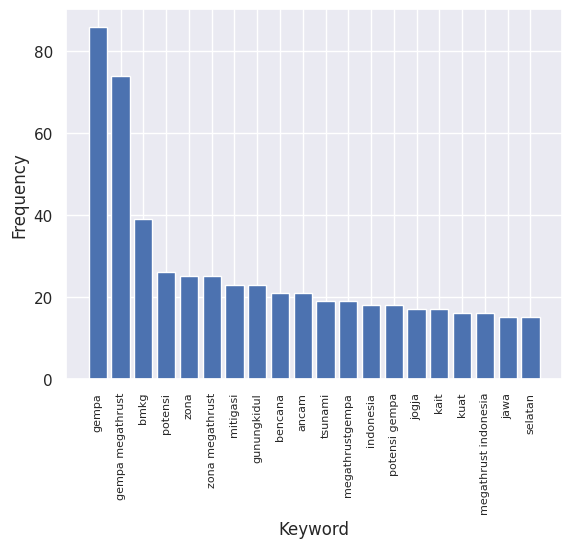
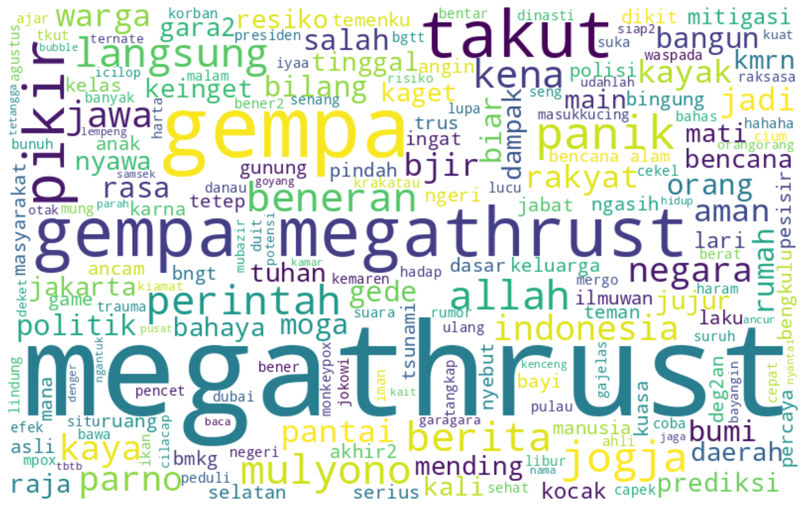
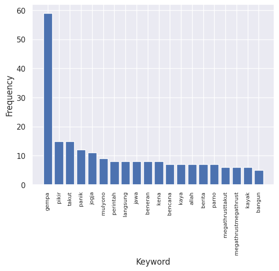

### Sentiment Analysis of 'Megathrust' on Twitter

Recently, in 2024, the issue of megathrust earthquakes has become a topic of conversation among the public. This has raised concerns about the potential impact of such earthquakes, which could result in significant casualties due to damaged buildings, landslides, and tsunamis. One of the preventive measures to minimize casualties from this disaster is to provide education on disaster mitigation so that people know what to do and what not to do when an earthquake occurs. It is hoped that these efforts will reduce public concern and prepare communities for whenever such a disaster might happen. However, to understand how prepared and responsive the public is to the issue of megathrust earthquakes, this project conducts a sentiment analysis using data from Twitter with the keyword 'megathrust.'

This project involves several steps for sentiment analysis, as described below:

1. **Crawling:** This step is necessary to gather data on public opinions regarding megathrust earthquakes on Twitter. The process uses tweet-harvest version 2.6.1, with the keyword 'megathrust lang:id until:2024-08-29 since:2024-01-01'. A total of 548 tweets were obtained, with 15 features.
2. **Text Preprocessing:** Once the data is collected, it needs to go through preprocessing to remove URLs, mentions, hashtags, apostrophes, punctuation, and double spaces and to convert text to lowercase. The text is then tokenized into smaller units using the nltk library. Common words that do not provide much information in the data are removed to reduce dimensionality and improve analysis accuracy. Stopwords used are obtained from nltk, stopword-id, and stopwords_twitter. Stemming is then performed to reduce word variations using the sastrawi library. Words with fewer than three letters are also removed, as they generally do not have meaningful content.

3. **Sentiment Classification:** After preprocessing, the data is classified using a pre-trained model called indonesia-bert-sentiment-classification, which has three classes: positive, negative, and neutral.
4. **Visualization:** The final output of this project is the visualization of the sentiment classification results using the matplotlib, seaborn, and wordcloud libraries.

The public sentiment regarding megathrust earthquakes is shown below:

| Sentiment | Percentage |
| --------- | ---------- |
| Neutral   | 55.29%     |
| Negative  | 34.31%     |
| Positive  | 10.40%     |

The sentiment distribution is displayed in the bar chart below:

Based on the data obtained, the majority of tweets are neutral. These neutral tweets are primarily news from official institutions or information shared by the public about megathrust earthquakes. The frequency of words that appear, excluding the word 'megathrust,' is shown in the following diagram:

Based on frequently appearing keywords, the news on Twitter mainly conveys information about potential earthquakes and the regions affected. The abundance of this news may increase public awareness of earthquake dangers. However, from the sentiment analysis results, it is found that the public response is largely negative, accounting for 34%. The most frequent keywords appearing in negative tweets are shown below:

This image indicates that people are experiencing concerns about this disaster. The 20 most frequent words, aside from 'megathrust,' in the negative category are shown below:

This likely occurs because there is still a misconception among the public about megathrust earthquakes, and people are unsure of what to do if such a disaster occurs.

### Conclusion

The sentiment analysis results on the topic of 'megathrust' on Twitter indicate that the public sentiment is predominantly negative due to concerns about facing such a disaster. Therefore, it is crucial for relevant authorities to implement programs that can better prepare the community for earthquake disaster mitigation.
